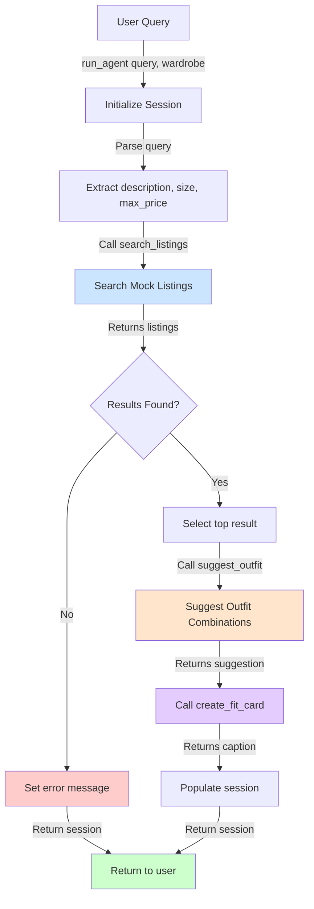

# FitFindr — planning.md

> Complete this document before writing any implementation code.
> Your spec and agent diagram are what you'll use to direct AI tools (Claude, Copilot, etc.) to generate your implementation — the more specific they are, the more useful the generated code will be.
> Your planning.md will be reviewed as part of your submission.
> Update it before starting any stretch features.

---

## Tools

List every tool your agent will use. For each tool, fill in all four fields.
You must have at least 3 tools. The three required tools are listed — add any additional tools below them.

### Tool 1: search_listings

**What it does:**
Searches the mock listings dataset for items matching a description, optional size constraint, and optional price ceiling. Returns a ranked list of matching listings sorted by relevance.

**Input parameters:**
- `description` (str): Keywords describing what the user is looking for (e.g., "vintage graphic tee").
- `size` (str | None): Size string to filter by (case-insensitive, e.g., "M", "S/M"), or None to skip size filtering.
- `max_price` (float | None): Maximum price (inclusive), or None to skip price filtering.

**What it returns:**
A list of matching listing dicts, each containing: `id`, `title`, `description`, `category`, `style_tags`, `size`, `condition`, `price`, `colors`, `brand`, `platform`. Listings are sorted by relevance score (highest first). Returns an empty list if no matches are found.

**What happens if it fails or returns nothing:**
Returns an empty list `[]` (does not raise an exception). The agent checks for empty results and sets a user-friendly error message, stopping before calling `suggest_outfit`.

---

### Tool 2: suggest_outfit

**What it does:**
Given a thrifted item and the user's existing wardrobe, suggests 1–2 complete outfit combinations pairing the new item with existing pieces. Uses the LLM to reason about style compatibility and generate styling tips.

**Input parameters:**
- `new_item` (dict): A listing dict containing at least `title`, `description`, `colors`, `style_tags`, `price`.
- `wardrobe` (dict): A wardrobe dict with an `items` key containing a list of wardrobe item dicts (each with `name`, `colors`, `style_tags`, `category`, `notes`). May be empty.

**What it returns:**
A non-empty string with outfit suggestion(s). If the wardrobe is non-empty, includes specific piece names and styling tips. If the wardrobe is empty, provides general styling advice (e.g., "This would pair well with..." or "Consider styling this with...").

**What happens if it fails or returns nothing:**
If the wardrobe is empty, the tool provides general styling guidance rather than raising an exception or returning an empty string. If the LLM fails, the agent logs the error and skips to `create_fit_card` with a fallback suggestion string.

---

### Tool 3: create_fit_card

**What it does:**
<!-- Describe what this tool does in 1–2 sentences -->
Generates a short, shareable outfit caption for the thrifted item, suitable for an Instagram or TikTok post. The caption should feel casual and authentic, mention the item name/price/platform naturally, and capture the outfit vibe.

**Input parameters:**
- `outfit` (str): The outfit suggestion string from `suggest_outfit()`.
- `new_item` (dict): The listing dict for the selected thrifted item, containing at least `title`, `price`, `platform`.

**What it returns:**
A 2–4 sentence string usable as a social media caption. If the outfit input is empty or whitespace-only, returns a fallback caption referencing the item and a generic vibe (does not raise an exception).

**What happens if it fails or returns nothing:**
If the outfit string is empty or None, the tool returns a descriptive fallback caption rather than crashing. If the LLM fails, returns a simple template caption like "Just thrifted this [item] for $[price] on [platform]. Loving it!"
---

### Additional Tools (if any)

<!-- Copy the block above for any tools beyond the required three -->

---

## Planning Loop

**How does your agent decide which tool to call next?**

The agent runs a sequential planning loop that responds to the results of each tool call:

1. **Initialize session:** Create a session dict with the query, parsed parameters, and placeholders for results.
2. **Parse query:** Extract `description`, `size`, and `max_price` from the user's natural language query using regex or string parsing.
3. **Call search_listings:** Pass the parsed parameters to `search_listings(description, size, max_price)`.
4. **Check for results (branch point):** If `session["search_results"]` is empty, set a user-friendly error message and return the session early (do NOT proceed to the next tools).
5. **Select item:** Otherwise, choose the top-ranked result (`search_results[0]`) and store it in `session["selected_item"]`.
6. **Call suggest_outfit:** Pass the selected item and wardrobe to `suggest_outfit(new_item, wardrobe)`, store the result in `session["outfit_suggestion"]`.
7. **Call create_fit_card:** Pass the outfit suggestion and selected item to `create_fit_card(outfit, new_item)`, store the result in `session["fit_card"]`.
8. **Return session:** Return the completed session dict.

The agent is **reactive**, not fixed-sequence: it only continues to steps 5–7 if step 4 finds results. If `search_listings` returns nothing, the loop terminates at step 4 and informs the user.

All state is stored in a single **session dict** that persists across tool calls and acts as the single source of truth:

```python
{
    "query": str,              # Original user query
    "parsed": {                # Extracted parameters
        "description": str,
        "size": str | None,
        "max_price": float | None
    },
    "search_results": list[dict],  # List of matching listings from search_listings
    "selected_item": dict | None,   # Top result from search_results
    "wardrobe": dict,              # User's wardrobe (passed in at start)
    "outfit_suggestion": str | None,  # String returned by suggest_outfit
    "fit_card": str | None,           # String returned by create_fit_card
    "error": str | None              # Error message if interaction failed
}
```

Each tool reads what it needs from the session and writes its output back to a specific key:
- `search_listings` → populates `session["search_results"]`
- `suggest_outfit` → populates `session["outfit_suggestion"]`
- `create_fit_card` → populates `session["fit_card"]`

The planning loop updates `session["error"]` if an early exit is triggered. At the end, the caller can check `session["error"]` to determine success or failure.

---

## State Management

**How does information from one tool get passed to the next?**

All state for a single interaction lives in **one `session` dict** created by
`_new_session(query, wardrobe)` at the top of `run_agent()`. This dict is the
single source of truth — there are no module-level globals and no re-prompting
the user between steps. The tools themselves are stateless pure-ish functions;
the agent loop is the only thing that reads from and writes to the session.

**What is tracked** (see the schema in the Planning Loop section):
`query`, `parsed` (description/size/max_price), `search_results`,
`selected_item`, `wardrobe`, `outfit_suggestion`, `fit_card`, and `error`.

**How data moves from one tool to the next** — each step reads the specific
session keys it needs and writes its output back to its own key, so the next
step can pick it up:

1. `parse_query(session["query"])` → writes `session["parsed"]`.
2. `search_listings(**session["parsed"])` → writes `session["search_results"]`.
3. The loop selects `session["search_results"][0]` → writes `session["selected_item"]`.
4. `suggest_outfit(session["selected_item"], session["wardrobe"])` → writes `session["outfit_suggestion"]`.
5. `create_fit_card(session["outfit_suggestion"], session["selected_item"])` → writes `session["fit_card"]`.

Critically, the **same object** is threaded through, not a copy or a
re-derived value: the exact dict stored in `session["selected_item"]` is the
one passed into both `suggest_outfit` and `create_fit_card`, and the string in
`session["outfit_suggestion"]` is passed verbatim into `create_fit_card`. This
was verified with `id()` checks — the selected item's identity is preserved
across both downstream calls, confirming state flows by reference rather than
being reconstructed at each step.

`run_agent()` returns the populated `session`. The caller (`handle_query()` in
`app.py`) then reads `session["error"]` first: if set, it shows the message and
leaves the other panels blank; otherwise it formats `selected_item`,
`outfit_suggestion`, and `fit_card` into the three output panels.

---

## Error Handling

For each tool, describe the specific failure mode you're handling and what the agent does in response.

| Tool | Failure mode | Agent response |
|------|-------------|----------------|
| search_listings | No results match the query | Return empty list `[]`. Agent detects this and sets `session["error"]` to a helpful message like "I couldn't find any matches for that query. Try removing size/price filters or searching with different keywords." Agent stops and returns early. |
| suggest_outfit | Wardrobe is empty or minimal | Detect `len(wardrobe["items"]) == 0` and call the LLM with a prompt for general styling advice instead. Return helpful suggestions without failing (e.g., "This pairs well with..." or "Consider styling with..."). |
| create_fit_card | Outfit input is missing, empty, or None | Check if `outfit` is empty/whitespace-only. If so, return a fallback caption template referencing the item and generic vibe rather than failing. |

---

## Architecture



**Data flow:**
- User input → `run_agent()` → Session initialized with query and wardrobe
- Session flows through each tool: query parsing → search → outfit → caption
- If search fails, agent short-circuits and returns with error
- Otherwise, final session contains selected item, outfit suggestion, and fit card
- All tools read and write to the session dict

---

## AI Tool Plan

<!-- For each part of the implementation below, describe:
     - Which AI tool you plan to use (Claude, Copilot, ChatGPT, etc.)
     - What you'll give it as input (which sections of this planning.md, your agent diagram)
     - What you expect it to produce
     - How you'll verify the output matches your spec before moving on

     "I'll use AI to help me code" is not a plan.
     "I'll give Claude my Tool 1 spec (inputs, return value, failure mode) and ask it to implement
     search_listings() using load_listings() from the data loader — then test it against 3 queries
     before trusting it" is a plan. -->

**Milestone 3 — Individual tool implementations:**

- **Tool 1 (search_listings):** Use Claude. Provide the Tool 1 spec (inputs, return value, failure mode), the listing schema from `data/listings.json`, and `utils/data_loader.py` to show how to load the data. Ask Claude to implement keyword matching and scoring based on overlap with `description`, `style_tags`, and `title`. Verify by running 3 test cases: (a) query for "vintage graphic tee" expecting multiple results, (b) query for "nonexistent item" expecting empty list, (c) query for "M" size filter expecting only M-sized items. Manual test via `python` REPL or unit tests.

- **Tool 2 (suggest_outfit):** Use Claude. Provide the Tool 2 spec, the wardrobe schema from `data/wardrobe_schema.json`, the example wardrobe, and a sample listing dict. Ask Claude to implement LLM prompting using the Groq client. Test two cases: (a) non-empty wardrobe with 10 items, verify the response names specific pieces from the wardrobe, (b) empty wardrobe, verify the response provides general styling advice without crashing.

- **Tool 3 (create_fit_card):** Use Claude. Provide the Tool 3 spec, emphasis on making the caption sound like a real social media post, and the item details. Ask Claude to implement LLM prompting with higher temperature for variation. Test three cases: (a) good outfit input, verify caption is 2–4 sentences and mentions item name/price/platform naturally, (b) empty outfit input, verify fallback caption still works, (c) same item twice, verify captions differ.

**Milestone 4 — Planning loop and state management:**

- Use Claude. Provide the complete `planning.md` (all sections), the `agent.py` stub file, and the `_new_session()` function. Ask Claude to implement `run_agent()` following the Planning Loop section step by step, with the guard clause for empty search results. Provide a test script with two test cases: (a) happy path query (should return all fields populated, no error), (b) no-results query (should return early with error set, other fields None). Run the test script to verify the flow works end-to-end.

---

## A Complete Interaction (Step by Step)

Write out what a full user interaction looks like from start to finish — tool call by tool call. Use a specific example query.

**Example user query:** "I'm looking for a vintage graphic tee under $30, size M. I mostly wear baggy jeans and chunky sneakers."

**Step 1: Initialize & Parse**
- `run_agent()` is called with the query and the user's wardrobe (e.g., `get_example_wardrobe()`)
- Session is initialized: `query`, `wardrobe` are stored, other fields are placeholders
- Query is parsed: `description="vintage graphic tee"`, `size="M"`, `max_price=30.0`
- Parsed values are stored in `session["parsed"]`

**Step 2: Search Listings**
- `search_listings(description="vintage graphic tee", size="M", max_price=30.0)` is called
- The tool loads all 40 listings, filters by price (≤ $30) and size (contains "M")
- Remaining items are scored by keyword overlap with "vintage graphic tee"
- Top 3–5 results are returned, e.g.:
  - `lst_006`: "Graphic Tee — 2003 Tour Bootleg Style", $24, size L, score: 0.85
  - `lst_002`: "Y2K Baby Tee — Butterfly Print", $18, size S/M, score: 0.60
- Results are stored in `session["search_results"]`

**Step 3: Check for Empty Results**
- `len(session["search_results"]) > 0` is true, so the agent continues
- Top result is selected: `session["selected_item"] = lst_006`

**Step 4: Suggest Outfit**
- `suggest_outfit(new_item=lst_006, wardrobe=example_wardrobe)` is called
- The LLM receives a prompt: "The user is considering buying [Graphic Tee — 2003 Tour Bootleg Style]. Their wardrobe includes [list of items with names, colors, styles]. Suggest 1–2 complete outfits."
- LLM response: *"Pair this with your baggy straight-leg jeans and chunky white sneakers for an effortless 90s grunge look. The faded graphic fits perfectly with your street style. You could also layer it under your black cropped zip hoodie for extra edge."*
- Result is stored in `session["outfit_suggestion"]`

**Step 5: Create Fit Card**
- `create_fit_card(outfit=session["outfit_suggestion"], new_item=lst_006)` is called
- The LLM receives a prompt: "Write a casual 2–4 sentence Instagram caption for this outfit: [outfit suggestion]. Item: [Graphic Tee — 2003 Tour Bootleg Style, $24, depop]. Make it sound authentic, mention the item and price naturally."
- LLM response: *"just thrifted this faded band tee on depop for $24 and it's already becoming my go-to 🖤 pairs so well with my baggy jeans and kicks — full 90s energy. obsessed"*
- Result is stored in `session["fit_card"]`

**Step 6: Return**
- `session["error"]` is `None` (no failure occurred)
- Final session contains:
  - `query`, `parsed`, `search_results`, `selected_item`, `outfit_suggestion`, `fit_card`, `error=None`
- Agent returns the completed session

**Final output to user:**
```
Found: Graphic Tee — 2003 Tour Bootleg Style ($24, depop, size L)

Outfit: Pair this with your baggy straight-leg jeans and chunky white sneakers 
for an effortless 90s grunge look. The faded graphic fits perfectly with your 
street style. You could also layer it under your black cropped zip hoodie for extra edge.

Fit card: just thrifted this faded band tee on depop for $24 and it's already 
becoming my go-to 🖤 pairs so well with my baggy jeans and kicks — full 90s energy. obsessed
```
